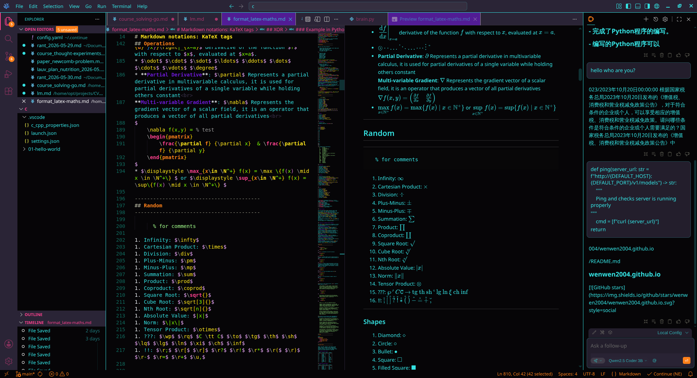
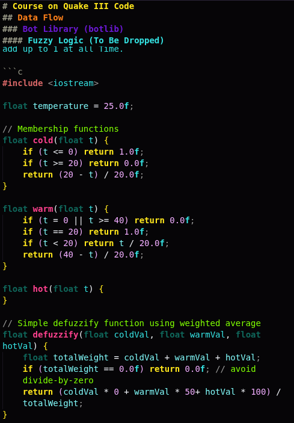

# Tokyo Terminal
================================================================================

```shin'en
   /$$            /$$            /$$     /$$$$$$$$$$      
  | $$/$$    /$$$$$$$$$$$$      /$$  /$$ |_______/$$      
   \/ $$    | $$__ $$__ $$     /$$  /$$      /$$/$$$      
   / $$     | $$  \$$  \$$    /$$$$$$$ /$$$$$$$$$$$$$$$   
  / $$ $$   | $$$$$$$$$$$$   |___/$$$  |___/$$$$\____ /   
/ $$ $$ \$$ | $$__ $$__ $$      /$$/ /$$   |__\$$$ /$$/   
|__/ $$ |_/ | $$$$$$$$$$$$    /$$$$$$$$$$ \$$$_$$$\$$/    
   | $$     | $$_| $$__ $$   /$$______/ \$|___/$$/$$$\    
   | $$     |__/ | $$  |_/   |/$$ |$$ \$$//$$$$$$|$$$\    
   | $$          | $$        /$$/ |$$  \$$\_/$$$/ |$$$_   
   |__/          |__/        |_/  |_/   \/|$$$$/   \$$$   
```

-------------------------
## Description
-------------------------

---
### Short Description (for marketplace/extension metadata)

```plaintext
Tokyo Terminal is a neon, high-contrast theme inspired by a retrofuturist 80s terminal aesthetics, and Tokyo electric nights. Built for clarity and vibrancy, with maximum visual efficiency.
```

---
### Long README Introduction

**Welcome to *tokyo-terminal***, a VS Codium/Code theme that transports your editor to a neon-colored terminal circa 1984.
This isn’t just a color scheme; it’s a high-contrast, high-energy workspace for developers who crave **clarity and visual accentuation**.

Transform VS Codium/Code into a neon-lit, retro-futurist terminal with high-contrast colors and synthwave accents inspired by Tokyo electric nights aesthetics.

#### Design Philosophy

Inspired by the **hypnotic color glow of vintage CRTs**, the **hyper-saturated dreams of synthwave**, *vibrancy of outrun nostalgia*, tokyo-terminal is a love letter to the 80s colors scheme as I reimagined, restylized and modernized them.
Think of **synths, oversaturated consoles**, a world of outrun sunsets and cyber alleyways, just free of VHS static and CRT noise. With a nod to Taki Ono’s neon design photography, this theme merges retro-futurism with modern clarity.

Aiming for a holistic environment theme, *tokyo-terminal* delivers:
- **Bold readability**: Crisp **cyan (#34e2e2)** syntax on deep **purple (#2a2436)** and **near-black (#060507)** backgrounds.
- **Electric accents**: Highlighted keywords, functions, and UI in **Hot pink (#FF418E)**, **sunset orange (#FE8019)** buttons, **gold (#FFE61C)**, and **deep violet (#6C18D6)** animations.
- **Retro-futuristic contrast**: Designed to reduce eye strain while keeping items *visually alive* — like a mainframe in a cybercafé circa 1984.
- **Minimalist efficiency** grit meets glamour.

For developers/writers nostalgic of the future. For those who conceptualize like the future depends on it (Because it does).

-------------------------
## Palette
-------------------------

| Color           | Hex        | Usage |
|---              |---         |--- |
| Black           | `#060507` | Darkest Background for text and coding   |
| Magenta         | `#2a2436` | Lighter Background for teminals and UI, also semi-hidden backreturn/separators signs and null values |
| BrightCyan      | `#34e2e2` | Main text, Object and classes names, section names in conf |
| Cyan            | `#116d61` | Types, Header 4  |
| Red             | `#fc5698` | Accents, functions and method names, Titles |
| BrightYellow    | `#ffe61c` | Keywords, Header 1  |
| Yellow          | `#fe8019` | FDunction calls, buttons, expandvars, Header 2 |
| BrightMagenta   | `#8b5cf6` | Activity/hover accent, decorators, Header 3 |
| BrightGreen     | `#A3FF8C` | Strings, hashtags   |
| Green           | `#7fff00` | Comments in some languages, math symbols in KaTeX |
| BrightRed       | `#FF3B3B` | Errors and Bool = false   |
| Blue            | `#3465a4` | Links   |
| BrightBlue      | `#0285f9` | Rarely used super accent, Header 6 |
| BrightWhite     | `#ECEFF4` | Plaintext, code symbols   |
| BrightBlack     | `#999988` | Comments in some languages, punctuation, Header 5 |
| White           | `#ACEEEE` | Variables in code, tables content  |
| +oldRed         | `#d66666` | Metaprocessors and loaders   |
| +Pink           | `#F1ADFF` | Decimal numbers in code, unresolved boolean, `this` keyword when in italic, values and keywords in `.ini`  |
| +Gold           | `#E3E9AE` | Property keys in yaml & json files, arguments  |

-------------------------
## ToDo
-------------------------

- [x] Funding by PayPal & ko-fi
- [x] Published VS Codium version on the marketplace
- [ ] Publishing VS Code version if incentivized
- [x] Published Obsidian version
- [ ] Find KaTeX devs and ask them to add an align tag resetter
- [ ] Publish Licence to SPDX
- [ ] Review port to Firefox
- [ ] Port to Chrome
- [x] **MarkDown** $\mathbf{[Full \space support]}$
- [x] **C** $\mathbf{[Full \space support]}$
- [ ] **C++** Needs review, 1.3.0 once validated
- [ ] **C\#** Probably some support in 1.3.0, unchecked till then.
- [x] **KaTeX** $\mathbf{[Full \space support]}$
- [x] **LaTeX**
- [x] **json** $\mathbf{[Full \space support]}$
- [x] **YAML** $\mathbf{[Full \space support]}$
- [x] **Python** $\mathbf{[Full \space support]}$
- [x] **HTML**
- [x] **VBA** $\mathbf{[Full \space support]}$ of .**cls** via serkonda7 `VBA` extension for syntax tokens
- [x] **CSS** $\mathbf{[Full \space support]}$
- [x] **bash** $\mathbf{[Full \space support]}$
- [x] .**js**
- [x] **java**
- [x] **Go**
- [x] **Git**
- [x] **SQL**
- [x] **Ts**
- [x] **Rust**
- [x] **Solidity** via juanfranblanco Solidity extension. Either the extension is rigged or the author is being downvoted by malicious actors, beware.
- [x] **php**
- [x] **XML**
- [x] .**ini** files, **dockerfiles**, .**conf** files $\mathbf{[Full \space support]}$
<br><br>
No complete support yet for all languages as long as I do not use them. Hopefully they are close enough for now

> Do not hesitate to drop me a line on GitHub if you need new tokens added, some more tweaks and like the color scheme. 

[](https://ko-fi.com/E8O422YFT1)

-------------------------
## Screenshots
-------------------------





***
**Made by 神縁 in 2026 under TSLST License**
[GitHub](https://github.com/TSLST)
[Mastodon](https://mastodon.social/@TSLST) Even though I don't actually like Mastodon